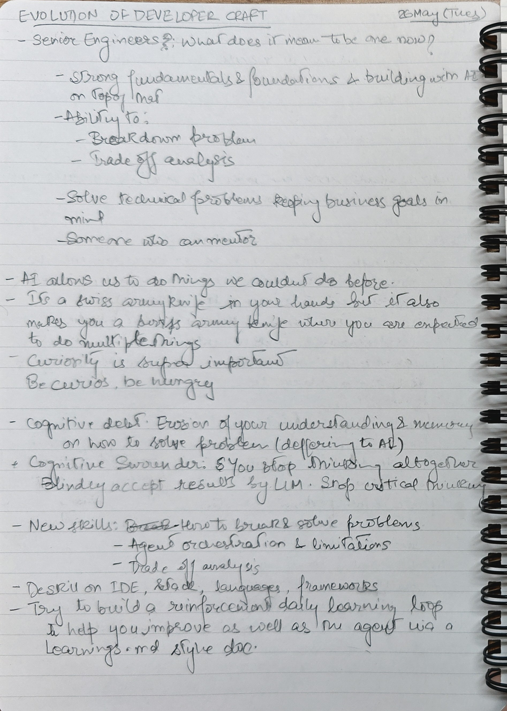
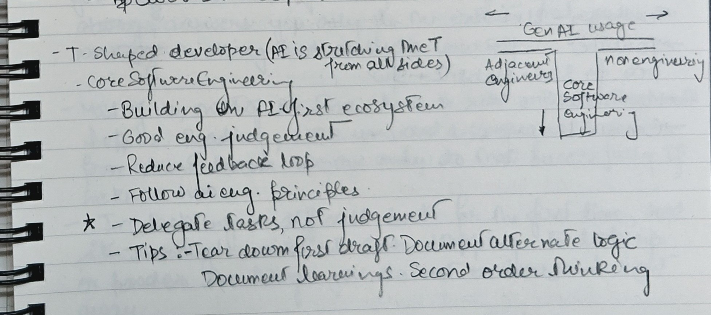

I watched parts of Google I/O 26 across the keynote, developer sessions android talks and panel discussions. I am not trying to write a complete announcement recap. I am mostly trying to preserve the notes that felt relevant to my work around Android, AI inside products, accessibility, smart glasses and engineering teams.

A lot of the current AI conversation in software engineering still focuses on how developers can use AI to build software faster. Useful, yes. But only one part of the shift.

The stronger pattern I noticed at I/O was around AI becoming part of the product surface itself, especially on Android. Google seemed to be connecting three ideas:

- AI features inside Android apps are becoming easier to build.
- Developer tooling is becoming more agent-aware.
- Engineering judgement becomes more important as agents take on more implementation work.

Those ideas showed up across different talks and panels and they shaped most of my takeaways.

---

## 1. AI in products is becoming more practical on Android

One observation stayed with me during the Android sessions:

> People talk a lot about how to use AI to build products, but not enough about how to put AI inside products.

The Android sessions were useful because they focused on the second part. Instead of only showing AI as a developer assistant, Google showed more of the platform pieces needed to build AI features into Android apps.

The pieces that stood out to me were:
- Gemini Nano for on-device AI
- ML Kit GenAI Prompt API Structured output
- Firebase AI for cloud-backed AI
- Hybrid inference between on-device and cloud
- APIs that make model access feel more native to Android development.

It all pointed to as more than "Android supports AI." Google seems to be reducing the friction for Android developers to build AI features without treating every interaction as a backend-only LLM call.

Mobile products are shaped by constraints like latency, privacy, offline use, battery, device capability, reliability, cost and accessibility. In accessibility products, those constraints directly affect whether someone can depend on the feature in a real situation.

My learning here:
- On-device AI is not only a performance optimization.
- More AI capability can move closer to the user, the device and the moment of need.
- For accessibility and assistive use cases, reliability at the edge can change the product experience.
- Android AI APIs are becoming more relevant for product architecture, not just model integration.

---

## 2. Hybrid inference feels like the practical middle path

The "on-device vs cloud" framing is useful, but real products rarely fit neatly into one side.

A better product question is:

> Which tasks should happen on-device, which tasks should go to the cloud and how should the app decide?

Hybrid inference stood out because it accepts that different tasks need different execution paths. Instead of sending everything to the same model, the application needs some routing logic based on user context, task complexity, device capability and failure behavior.

On-device inference can be useful for:
- lower latency,
- privacy-sensitive tasks,
- offline or poor-network situations,
- lightweight classification,
- simple structured responses,
- and fast interaction loops.

Cloud inference can still be useful for:
- larger reasoning tasks,
- more capable models,
- broader world knowledge,
- complex multimodal tasks,
- and heavier workflows.

The engineering work sits in the decision layer between the two. Not every prompt needs the same model. Not every user state needs the same fallback. Not every feature should fail in the same way.

My learning here:
- The routing layer may become one of the most important parts of AI product design.
- Teams will need to decide when to prefer speed, privacy, cost, capability, or reliability.
- "Use AI" is too vague to be a product strategy.
- Choosing the right inference path for the user context is where the real design work starts.

---

## 3. Structured output is more useful than flashy demos

Structured output is easy to underplay because it does not look as impressive as a polished AI demo. For product teams, predictable output is often more valuable than a beautifully written paragraph.

A mobile app usually does not need free-form text alone. It often needs something it can act on:
- a category,
- an action,
- a list,
- a confidence level,
- a next step,
- an error state,
- a UI state,
- or a decision object.

Free text is easy to demo. Structured output is easier to connect to product behaviour. It gives the app something stable enough to use for UI state, navigation, accessibility labels, analytics, logging, testing and fallback behaviour.

AI product work quickly starts looking less magical and more like normal engineering. You still need contracts. You still need schemas. You still need fallbacks, tests and review points.

My learning here:
- The more AI moves into products, the more we need boring engineering discipline around it.
- Schemas and contracts become more important, not less.
- Reliability will come from constraints around the model, not from trusting the model more.
- Product teams should care as much about output shape as they care about model capability.

---

## 4. Android tooling is becoming more agent-aware

Another pattern from the developer keynote was the shift toward Android tooling that can support agentic workflows.

The notes that stood out to me were:
- Android CLI
- Android knowledge base
- Android skills
- Migration assistance
- Agent workflows that can use Android-specific tools

Android development is not just writing Kotlin. A useful Android agent needs to understand the development environment around the code. It needs context around things like Gradle config, Compose UI & Navigation, Permissions and performance.

Generic code generation can help, but Android has enough platform-specific complexity that agents need better tools, skills and guardrails. As agents become more capable, the human role moves further toward task definition, context design and review.

Capability also increases risk. An agent that can do more can also make larger mistakes faster.

My learning here:
- Android-specific agent skills are more useful than generic code generation.
- Agents need access to the development environment, not just the source files.
- Engineers need to get better at defining tasks, providing context, reviewing assumptions and protecting the system.
- Faster implementation makes review quality more important.    

---

## 7. Senior engineering now means working from a higher altitude

The "Evolution of Developer Craft" discussions really connected with me because they focused less on specific tools and more on how engineering roles are changing.

The theme I noted:

> Business context and user needs are expected from more engineers now, not only senior engineers.

I agree with the direction. AI makes it easier to produce more output, so the bottleneck moves from producing code to deciding what should be produced and why.

The useful questions become:
- What problem are we solving?
- Why does it matter?
- What tradeoff are we making?
- What should not be automated?
- What should be tested upfront?
- What failure mode are we accepting?
- What part requires a human's judgement?
- What should be reviewed by a human?

Fundamentals do not become less important in this environment. They become more important because implementation speed can hide weak thinking. When teams move faster, poor judgement also scales faster.

My learning here:
- Senior engineers need to operate at a higher altitude without losing technical depth.
- Problem breakdown, trade-off analysis and business alignment become more visible parts of the role.
- AI does not reduce the need for engineering judgement; it increases the cost of weak judgement.
- The role shifts toward clearer thinking, not only faster delivery.

---

## 8. The T-shaped developer is being stretched

One phrase from my notes captured the change well:

> AI is stretching the T from all sides.

The vertical part of the T still matters. Engineers still need depth in core software engineering: architecture, systems, code quality, testing, performance, debugging, maintainability, security and platform behavior.

At the same time, the horizontal part is expanding. Engineers are being pulled closer to product thinking, user needs, business goals, rollout strategy, risk management, documentation, agent orchestration and cross-functional decisions.

AI becomes a swiss-army knife in your hand, but it also makes you more of a swiss-army knife. The extra range can be useful, but it can also push people toward shallow understanding across too many areas.

My learning here:
- AI increases range, but engineers still need depth.
- The goal is not to become average at everything.
- AI should extend your reach without weakening your core judgement.
- Curiosity becomes more valuable when the boundaries of the role expand.

---

## 9. Cognitive debt is a real risk

I liked the framing around cognitive debt and cognitive surrender.

As Addy Osmani stated :

- **Cognitive debt** is the slow erosion of your own understanding because you keep delegating thinking to AI.
    
- **Cognitive surrender** is when you stop thinking altogether and blindly accept the result.
    

Both are easy traps because AI output can look convincing. The explanation sounds confident. The code compiles. The agent says the tests pass. The implementation seems complete.

None of those signals prove that you understand the system better.

I want to be more deliberate about the questions I ask after an AI-assisted session:

- What did the agent miss?
- What did I miss?
- What assumption was hidden?
- What should I have specified earlier?
- What test would have caught this?
- What should go into a `learning.md` file?
- What should become a reusable instruction or guardrail?

The goal is not just to complete one task faster. A good AI-assisted workflow should leave behind better context, better tests, or better instructions for the next task.

My learning here:
- AI should not replace understanding.
- Every AI-assisted session should improve the system around the work.
- If the agent improves but the engineer learns nothing, the workflow is incomplete.
- Reviewing the output is not enough; we also need to review the thinking that produced it.

---

## 10. Treat AI as an adversarial mentor

One practical idea I liked was to treat AI as an adversarial mentor.

Not hostile. Not difficult for the sake of being difficult. But also not overly agreeable.

A useful AI assistant should challenge unclear requirements, missing tests, weak assumptions, overcomplicated architecture, skipped edge cases, risky shortcuts and decisions that sound good but do not match the product goal.

That approach feels more useful than asking AI to simply "improve this" or "write code for this."

Better prompts:
- "Find what is wrong with this plan."
- "What am I missing?"
- "What would break in production?"
- "What would make this hard to test?"
- "What assumption am I making?"
- "Argue against this approach."
- "Review this as a strict senior engineer."

The value is not only in the answer. The value is in keeping the human engaged in the thinking process. A good adversarial review makes it harder to drift into cognitive surrender.

My learning here:
- AI is more useful when it challenges your work, not only when it completes your task.
- Adversarial review should become part of AI-assisted engineering workflows.
- The best use of AI may be improving judgement, not only improving speed.
- Agreement is cheap; useful disagreement is much more valuable.

---

## 11. The new skill is designing the AI environment

The more I use agents, the less I think the core skill is prompting. Prompting helps, but it is not enough.

The more important skill is environment design.

A good AI environment needs:
- clear project context,
- task boundaries,
- coding conventions,
- architecture rules,
- test commands,
- decision logs,
- examples,
- review instructions,
- and feedback loops.

Files like these become critical:
- `AGENTS.md`
- `SKILLS.md`
- PRDs
- task trackers
- implementation plans
- testing notes
- `learning.md`
- decision logs

I do not see these as paperwork. I see them as a way for a team to transfer judgement into the system.

Agents can help execute, but the environment tells them what "good" means. Without that context, agents may still produce output, but the output may not match the product, the architecture, the team’s standards, or the user need.

My learning here:
- The quality of AI-assisted work depends heavily on the quality of the environment around the agent.
- Good instructions, tests, examples and decision logs compound over time.
- Teams should treat their AI environment as engineering infrastructure.
- Prompting is useful, but system design around the agent is more durable.

---

## 12. Delegate tasks, not judgement

The strongest note for me was:

> Delegate tasks, not judgement.

Most of my Google I/O 26 takeaways connect back to that idea.

AI can help with implementation, exploration, refactoring, testing, documentation, migration, UI scaffolding and product prototypes. It can reduce repetitive work. It can help produce a first draft faster. It can explore options that would otherwise take more time.

Judgement still belongs to the engineer and the team.

Judgement means knowing:
- what matters,
- what can fail,
- what should be reviewed,
- what tradeoff is acceptable,
- what user need is real,
- what complexity is unnecessary,
- and what should not be delegated.

As the tools become stronger, the responsibility around them has to become stronger too.

My learning here:
- AI can take over more tasks, but it should not take over accountability.
- Engineers need to become better reviewers, planners and decision-makers.
- The more we delegate execution, the more deliberately we need to protect judgement.
- Stronger tools require stronger ownership.

---

## Final takeaway

My main learning from Google I/O 26 is that AI is moving from a side tool into the product and engineering loop itself.

It is showing up in Android apps, on-device models, cloud fallback paths, hybrid inference, structured output, agent-driven UI, developer tools, migration workflows and engineering team practices.

The future Android engineer is not just someone who knows how to call an AI API. It is also not just someone who can use an AI coding assistant.

The stronger version is someone who can build AI into products carefully, use agents without surrendering judgement and design systems where both humans and AI can work with clearer context.
