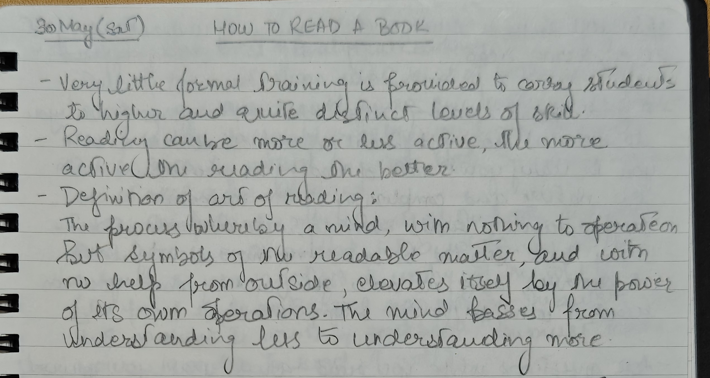
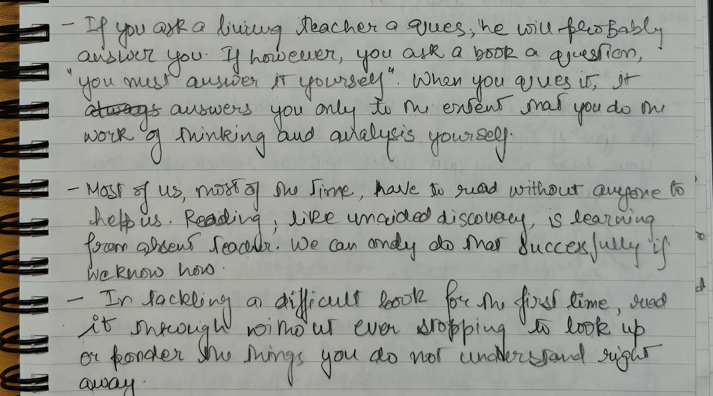
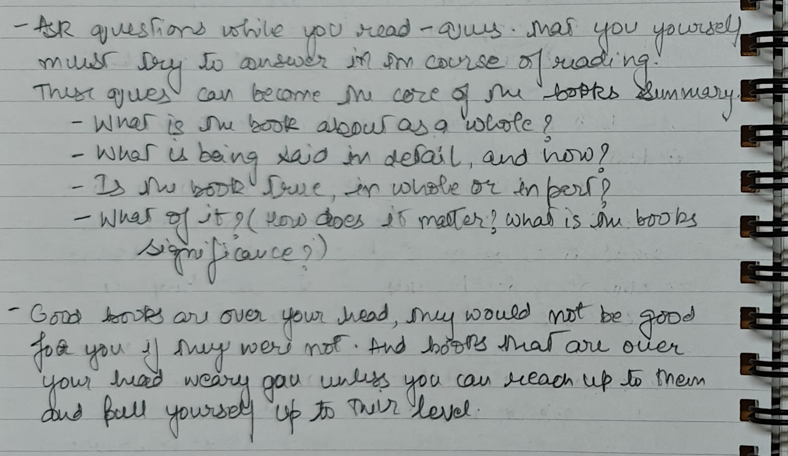
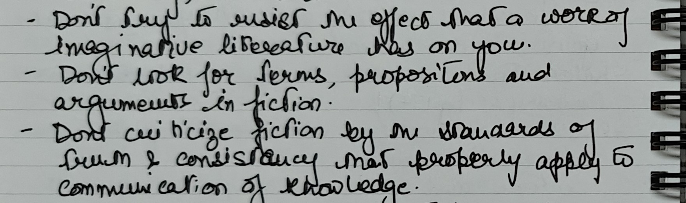
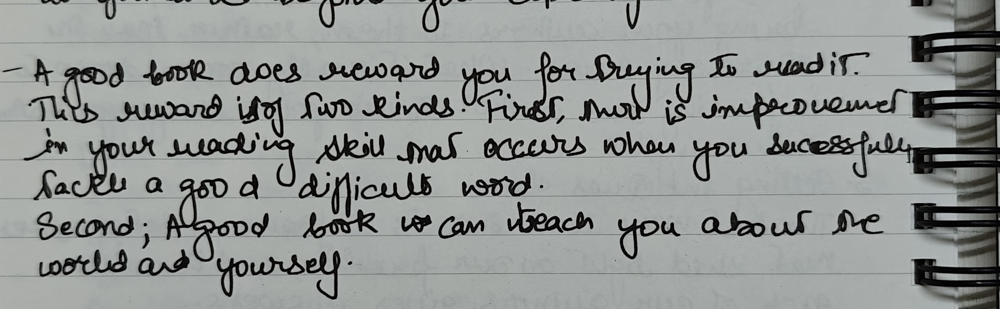

As I begin my journey to read more, I started coming across books that I did not understand. They were difficult to read and were going a little over my head. This really sparked a curiosity in me on how can I start reading more difficult literature. What steps I need to follow to upgrade my reading skills. And *How to Read a Book* came up multiple times by many established authors as a recommendation to improve reading comprehension. 

Not faster. Not more impressive. Just better.

And reading this book itself was a journey of its own. This book teaches you how to approach difficult books and this book 'is' a difficult book. I really had to follow the instructions in the book to read this book.

Mortimer J. Adler and Charles Van Doren pushed me to look at reading in a slower way. A book is not something I simply pass through. A serious book asks something from me. I have to question it, sit with it, argue with it and sometimes return to it after the first attempt has only opened the door.

The main value of the book for me was the reminder that reading is not passive.

## Reading as effort

The book describes reading as *"learning from absent teachers."*

I liked that image. A teacher in front of me can notice confusion, answer a question or change the explanation. A book cannot do any of that. When I am confused by a book, the book just sits there. The responsibility moves back to me.

I have to slow down. I have to ask better questions. I have to decide whether I am confused because the author is unclear, because the subject is difficult or because I am moving too quickly.

Reading well requires a kind of humility that I do not always bring to a book. Sometimes I want the idea to reveal itself immediately. Sometimes I want the first pass to be enough. A difficult book makes those expectations look childish.

A good book can be above my current level without being outside my reach. Adler and Van Doren put it more sharply: *"Good books are over your head."* Those are often the books worth reading carefully because they stretch the mind instead of letting it remain comfortable.

One practical idea from the book helped here: on the first pass through a difficult book, do not stop at every sentence that is unclear. Pay attention to what can be understood and keep moving. The second reading has a better chance if the first reading gives me a rough shape of the whole.

I found that useful and slightly uncomfortable.

## The questions I want to keep

The most practical part of the book is the set of questions it asks the reader to carry into any serious reading. The questions move through a simple order: understand the whole book, understand the details, decide what is true and then ask why any of it matters.

I have seen versions of these questions before, but the order felt important while reading this book. First understand the whole. Then understand the parts. Then judge. Then decide why the judgment matters.

I often want to skip ahead. I want to decide quickly whether I agree. I want to know whether the book is useful. I want to extract the best lines and move on. The book quietly argues against that habit. Agreement and disagreement should come after the work of understanding.

Reading with those questions changes the pace. The goal becomes less about finishing and more about staying awake while reading.

## Analytical reading

Analytical reading is the heart of the book.

At this level, the reader is not only following sentences. The reader is trying to understand the shape of the whole work: what kind of book it is, what problem the author is trying to solve, what claims are being made and how those claims hold together.

The phrase I liked here was *"make your own outline."* A good reader is not only accepting the author's structure. A good reader is trying to reconstruct it.

The book makes a useful point about words and thought. Sentences and paragraphs are visible on the page, but the real work is finding propositions and arguments. In simpler terms, I should not stop at the wording. I should try to understand what the author is actually saying and why.

Obvious as the idea sounds, I can still see how often I read lazily.

Sometimes I understand the words but not the argument. Sometimes I remember a phrase but lose the structure. Sometimes I can say whether I liked the book, but I cannot explain what problem the author was trying to solve.

Analytical reading asks for more honesty than that.

## Not every book asks for the same kind of reading

One part I appreciated was the reminder that different books need different reading habits.

A **practical book** wants some kind of decision from the reader. If I agree with it, some action or change should follow. Otherwise the agreement is only decorative.

**Fiction** asks for something else. A story should be entered before it is judged. Looking for arguments in a novel too early can flatten the experience. The imagination needs room before criticism begins.

I do not want to treat every book like an exam. I want to notice what kind of attention a book deserves.

Some books are for rest. Some are for information. Some are for beauty. Some are for being challenged. Confusing those modes can make reading feel either too heavy or too shallow.

The same applies to speed. The book is not against reading quickly, but it argues for reading *"no more slowly than it deserves."* Some pages should be moved through lightly. Some deserve slow attention. The mistake is treating one pace as a virtue.

## Reading across books

The highest level in the book is synoptical reading: reading many books around the same question.

I liked this section because it describes a kind of reading that feels messy but honest. A reader starts with a question, looks across multiple books, finds the relevant passages, compares different authors and slowly understands the shape of a larger conversation.

No single book owns the subject. The reader has to do the connecting work.

There is a strange problem here. Before I understand a subject, I do not fully know which books are most important. But without reading across the subject, I cannot understand it well enough to choose perfectly. The only way through is to begin imperfectly and let the question become clearer along the way.

I found that reassuring. Serious reading does not always begin with a perfect map.

## What stayed with me

The book changed the way I want to measure reading.

Finishing a book is not nothing. There is value in completing the effort. But finishing is not the deepest measure.

Better questions are:
- Did I understand the author more clearly?
- Did I notice where I was confused?
- Did I separate the argument from my first reaction?
- Did I change my mind about anything?
- Did the book leave me with a better question?

I do not want every book to become work. Reading should still include pleasure, curiosity and wandering. But for books that deserve care, I want to bring more care.

*How to Read a Book* is not really about collecting reading techniques. For me, it is about respecting reading as an act of attention.

Read less passively. Ask better questions. Let difficult books take time.

For now, I am happy to start there.
